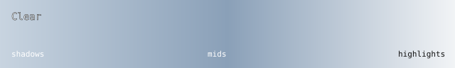
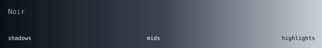
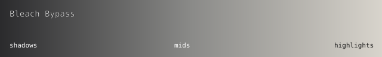
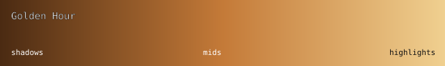
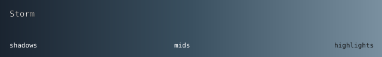
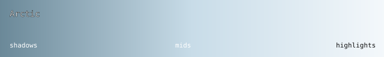
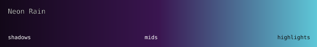

# Look bible

Named artistic looks for the Street View weather/grading stack. Each look is a
**scene pack**: weather sliders + color grade + time of day + optional vehicle
lights, applied in one click from the Looks panel or `?look=<id>`.

Grading is the existing 6-knob chain (vibrance → saturation → contrast →
temperature/tint → exposure) plus, on WebGPU, a 32³ HALD LUT from
`public/luts/<id>.png`. ACES filmic tonemap stays last. Identity / `clear`
skips LUT sampling so default pixels stay bit-equal to the ACES-only path.
The 40-float weather layout is unchanged (LUTs are textures, not uniforms).
No extra billable APIs.

Source of truth: `src/config/lookPacks.ts` and `src/renderer/lut.ts`. Palette
cards and LUT-graded test charts (`<id>-webgpu.png`) are committed fixtures.
Live panorama GPU frames should be recaptured on WebGPU Chrome (see Capture).

Related: `docs/GRAPHICS.md` §3 (weather presets) and §8 (looks), 
`docs/RENDERER_FALLBACK.md` (must-match vs best-effort).

---

## Capture (WebGPU Chrome)

This cloud/CI environment has no WebGPU adapter, so live panorama screenshots
cannot be produced here. On a WebGPU-capable Chrome/Edge:

1. Open a stable pano (deep-link lat/lng/heading) at default day, `?look=clear`.
2. Snapshot the WebGPU canvas → `docs/looks/clear-webgpu.png` (the **before**).
3. For each look: `?look=<id>` with the same pano/heading → `<id>-webgpu.png`.
4. Or run `npm run capture:look-goldens` against a keyed `npm start` on that host.
5. Optional A/B: `?effect=weather|night|fog&look=<id>` (WebGPU) for
   directional parity (night floor, precip fall, overcast sun kill). GLSL
   must-match literals are in `src/renderer/webgl/weatherReference.glsl.ts`.

Until those PNGs land from a WebGPU host, the committed `<id>-webgpu.png` files
are LUT-graded test charts generated by `npm run gen:look-luts` (same 6-knob
curve as the HALD volume). The SVG palette cards remain the design reference.

---

## Looks

### ☀️ Clear (`clear`) — reset / before

- **Weather:** rain 0 / snow 0 / fog 0 / wind 0 · TOD day
- **Grade:** all knobs neutral (1 / 1 / 1 / 0 / 0 / 0)
- **Curve:** untouched shadows/mids; ACES only on highlights
- **Before:** whatever look was on
- **After:** stock Street View color, sun FX at the cohesion floor

### 🎬 Noir (`noir`)

- **Weather:** rain 25 / fog 18 / wind 12 · TOD night · headlights · wipers
- **Grade:** vib 0.45 · sat 0.35 · con 1.55 · exp −0.25 · temp −0.45 · tint +0.15
- **Curve:** cool crushed shadows, thin desaturated mids, hard headlight specular then ACES
- **Before:** daylight panorama, Google-saturated signs, flat exposure
- **After:** silver pavement, crushed sky, sparse rain, headlight pools. Color almost gone except cool lamps. Night floor from #171 keeps the road readable.

### 🧡 Teal & Orange (`teal-orange`) — travel poster

- **Weather:** fog 8 · TOD sunset
- **Grade:** vib 1.35 · sat 1.25 · con 1.18 · exp +0.12 · temp +0.42 · tint −0.28
- **Curve:** teal shadows, lifted mids, orange sun highlights into ACES
- **Before:** generic afternoon, mixed white balance, no sky drama
- **After:** sun side honey/orange; shade and asphalt pick up teal. Horizon glow agrees with camera heading.

### 📰 Bleach Bypass (`bleach-bypass`)

- **Weather:** fog 22 (overcast sun kill) · TOD day
- **Grade:** vib 0.55 · sat 0.50 · con 1.65 · exp +0.15 · temp −0.05
- **Curve:** hard shadow floor, silver-retention mids, slight overexposure compressed by ACES (not clipped)
- **Before:** colorful storefronts and sky, soft Google contrast
- **After:** harsh metallic mids, retained highlight texture, almost no chroma. Sky goes newsreel grey.

### 🌅 Golden Hour (`golden-hour`)

- **Weather:** fog 6 · TOD sunrise (camera-aware wash)
- **Grade:** vib 1.25 · sat 1.15 · con 1.08 · exp +0.18 · temp +0.48 · tint −0.18
- **Curve:** warm lifted shadows, honey mids, temp +0.48 rolling into ACES
- **Before:** default day — white sun, no atmosphere
- **After:** honey low sun on the tracked azimuth, soft far-field haze, lifted exposure

### ⛈️ Storm (`storm`)

- **Weather:** rain 100 / wind 80 / fog 35 (GRAPHICS.md §3 storm) · nightIntensity 0.22 · wipers
- **Grade:** vib 0.70 · sat 0.75 · con 1.25 · exp −0.35 · temp −0.28 · tint +0.18
- **Curve:** cool underexpose, muted greens, no sun FX (overcast ≳ 0.85)
- **Before:** clear noon, lens flare, dusty air
- **After:** sun gone, wet haze, streaks slanted with wind, scene −~26% by day (rain darken eases to −10% at night)

### ❄️ Arctic (`arctic`)

- **Weather:** snow 85 / wind −40 / fog 20 · TOD day
- **Grade:** vib 1.05 · sat 0.82 · con 1.22 · exp +0.28 · temp −0.22 · tint +0.05
- **Curve:** lifted cyan shadows, sat pulled so snow stays white, flake edges held by contrast then ACES
- **Before:** temperate street, warm pavement, no particles
- **After:** high-key snow, cool air, flakes falling **downward**, far field softened

### 🌃 Neon Rain (`neon-rain`)

- **Weather:** rain 55 / wind 25 / fog 16 · TOD night · headlights + high beam · wipers
- **Grade:** vib 1.15 · sat 1.05 · con 1.28 · exp −0.15 · temp −0.35 · tint +0.35
- **Curve:** cyan-black shadows (night floor), magenta mids, headlight warmth vs neon, ACES last
- **Before:** stock night — crushed or merely blue-tinted, dry pavement
- **After:** wet asphalt, cyan haze in the distance, magenta bounce, headlight cones, rain streaks downward

---

## URL params

| Key | Meaning |
|-----|---------|
| `look` | Named pack id |
| `rain` `snow` `fog` | 0–100 |
| `wind` | −100..100 |
| `tod` | `day` \| `sunrise` \| `sunset` \| `night` |
| `vib` `sat` `con` `exp` `temp` `tint` | Grading knobs (UI space) |
| `night` | 0–1 night intensity |
| `hl` `beam` `dome` `wipers` | `1` / `0` |

Location keys (`lat` `lng` `heading` `pitch` `zoom` `pano`) are independent and
preserved by **Copy look as URL**.

---

## Reduced motion

`prefers-reduced-motion` / the a11y toggle already zeroes cinematic DOF and
motion blur (`cinematicCameraFx.ts`, uniforms 38/39). Looks do **not** depend
on those slots — applying Noir with reduced motion still packs the grade,
night, and rain.
